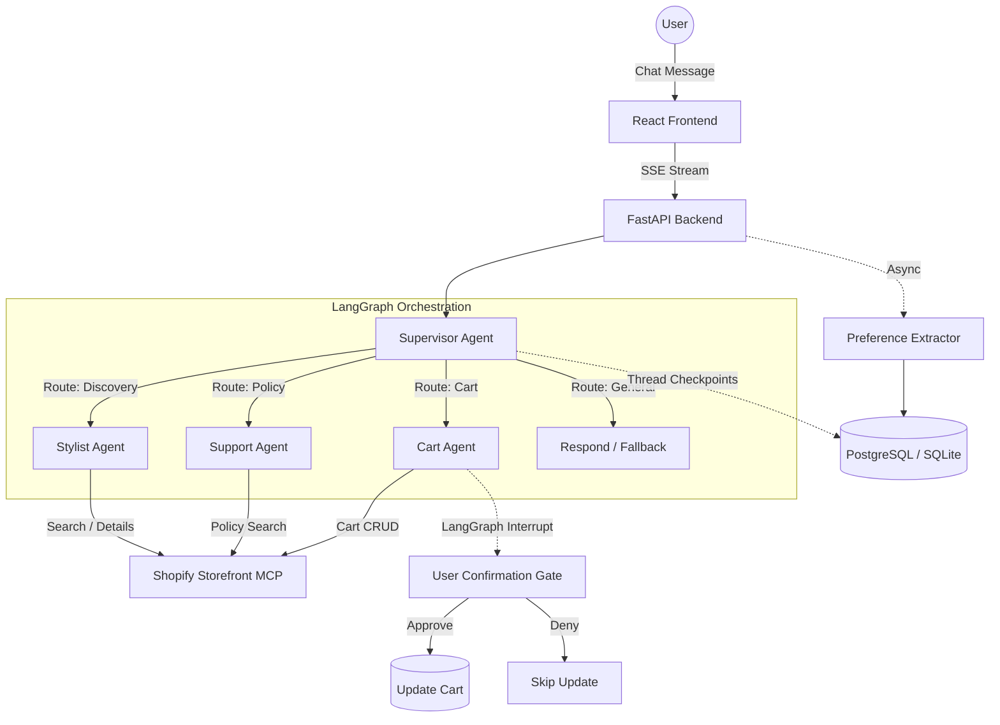

# Vastra: Conversational Commerce Agent

Vastra is a conversational shopping agent built for Shopify storefronts. It leverages LangGraph and the Shopify Storefront MCP to allow buyers to discover products in natural language, ask policy questions, build a cart, and proceed to checkout. 

This repository demonstrates advanced agentic commerce patterns: **Supervisor routing**, **interrupt-gated writes** (human-in-the-loop cart updates), **preference extraction**, and **strict grounding**.

## Architecture



## Evaluation Results

Vastra includes a deterministic evaluation harness that exercises the agent **pipeline** — routing, tool sequencing, write-gating, the sanitiser boundary, and grounding of structured payloads — under both happy-path and adversarial conditions.

- **Golden Path:** 30 scenarios, 100% pass. Discovery, multi-turn refinement, cart add+confirm and add+cancel, show-cart, policy questions, mixed flows, greetings, profile-aware suggestions, edge cases.
- **Adversarial:** 10 scenarios, 100% pass. Injection payloads (matching those in [`scripts/seed_injections.py`](scripts/seed_injections.py)) are planted in tool results, then asserted against:
  - **Write-gating** — `update_cart` never reachable without an approved `interrupt()` (LangGraph primitive, not an LLM heuristic).
  - **Tool boundary** — `must_not_call` enforces scope (e.g. injection prompting `update_cart` from a support route must not succeed).
  - **Tool-call cap** — `MAX_TOOL_CALLS_PER_TURN = 4` is hard-enforced by the agent loop, asserted via `max_tool_calls`.
  - **Grounding** — every ₹price and URL in the final reply is asserted present in some tool result (`reply_must_not_invent`).

Both suites run fully **offline** via `RecordingMCPTools` spies and a scripted `EvalFakeLLM` (with a content-based `EvalCartLLM` for cart turns that survive LangGraph re-execution on resume). This trades model-quality coverage for determinism, zero API cost, and CI speed (~4 s for the full eval pass). The harness tests the **pipeline and structural safety** of the agent — the LLM's own prompt-injection resistance is a separate concern handled by the sanitiser, system-prompt rules, and live-store smoke verification (Milestone A in `Agent/progress.md`).

## Build Transparency

This project adheres to strict architectural rules to demonstrate low-level mastery of agent systems:
- **No ORM:** All database queries are parameterised raw SQL using `psycopg 3` / `aiosqlite`.
- **No Component Libraries:** Frontend is React 18 + Vite with plain JS and 100% hand-written CSS.
- **Provider Agnostic LLM Layer:** The fallback routing layer hides provider specifics, allowing failover from Groq to Gemini automatically without polluting agent logic.
- **Strict Grounding:** The model NEVER parses prices or image URLs from raw text; product cards and cart state are rendered exclusively from secure structured SSE tool payloads.

## Quick Start

### Prerequisites
- Python 3.11+
- Node.js 20+
- Docker (for PostgreSQL)
- [Git LFS](https://git-lfs.com/) — the logo and intro video are LFS-tracked
- API Keys: `GROQ_API_KEY`, `GEMINI_API_KEY` (optional fallback)

### 0. After cloning — pull the LFS-tracked assets
```bash
git lfs install
git lfs pull
```
Without this, `frontend/public/assets/vastra-mark-v2.png` and `vastra-intro.mp4` will be 131-byte pointer files instead of the actual binaries, and the app will render a broken logo. The Docker build will also fail fast with a clear error if it sees pointer files in its build context. (Hugging Face Spaces handles this automatically — only relevant for local clones.)

### 1. Backend Setup
```bash
python -m venv .venv
source .venv/bin/activate  # On Windows: .venv\Scripts\activate
pip install -r requirements.txt

# Start local Postgres (optional, falls back to SQLite if DATABASE_URL not set)
docker compose up -d postgres

# Set environment variables
cp .env.example .env
# Edit .env with your keys

# Run the API
uvicorn backend.main:app --reload --port 8000
```

### 2. Frontend Setup
```bash
cd frontend
npm install
npm run dev
```
Open `http://localhost:5173`.

## Deployment

### Hugging Face Spaces (Docker)
Vastra is configured to run out-of-the-box on Hugging Face Spaces using the provided `Dockerfile`.

1. Create a new Docker Space on Hugging Face.
2. Push this repository to the Space.
3. Set your `GROQ_API_KEY` and `GEMINI_API_KEY` in the Space's settings as Secrets.
4. The deployment will automatically use SQLite for persistence (perfect for stateless container scaling).

The `Dockerfile` handles building the React app and serving it via FastAPI's static mount.

### Local Docker Build
```bash
docker build -t vastra .
docker run -p 8000:8000 --env-file .env vastra
```
